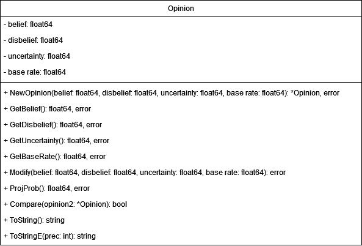

# go-subjectivelogic

## Overview

This Go library implements subjective logic functionalities. It therefore provides an [Opinion](#opinion) struct as well as a set of Subjective Logic Operators:

* [Addition](#addition)
* [Complement](#complement)
* [Binomial Multiplication](#binomial~multiplication)
* [Binomial Comultiplication](#binomial~comultiplication)
* [Belief Constraint Fusion](#belief~constraint~fusion)
* [Cumulative Fusion](#cumulative~Fusion)
* [Averaging Fusion](#averaging~fusion)
* [Weighted Fusion](#weighted~fusion)
* [Trust Discounting](#trust~discounting)
* [Consecutive Trust Discounting](#consecutive~trust~discounting)

## Opinion

## Addition
This implements the Addition Operator as defined in Subjective Logic.
If the function encounters a problematic input, or the resulting Opinion is malformed, an error will be returned instead.

### Implementation
The Addition Operator is defined as:

$$
\omega_{(x\cup y)} = 
\begin{cases}
b_{x\cup y} = b_x + b_y \\
d_{x\cup y} = \frac{a_x(d_x - b_y) + a_y(d_y - b_x)}{a_x+a_y} \\
u_{x\cup y} = \frac{a_xu_x + a_yu_y}{a_x+a_y} \\
a_{x\cup y} = 0
\end{cases}
$$

#### Problematic Inputs
The Addition Operator has the problem of not always returning a proper Opinion. Inputs $\omega_{x} = {b_x, d_x, u_x, a_x}$, $\omega_{y} = {b_y, d_y, u_y, a_y}$ are problematic, if:

$$
\begin{split}
b_x + b_y &> 1 \text{, or} \\
a_x + a_y &> 1 
\end{split}
$$

Also, the Addition Operator will attempt to divide through $0$, if $a_x = a_y = 0$, hence this is not allowed and an error will be returned.

## Complement
This implements the Complement Operator as defined in Subjective Logic.
If the resulting Opinion is malformed, an error will be returned instead.

### Implementation
The Complement Operator is defined as:
$$
	\omega_{\overline{x}}  :
	\begin{cases}
		b_{\overline{x}} = d_x \\
		d_{\overline{x}} = b_x \\
		u_{\overline{x}} = u_x \\
		a_{\overline{x}} = 1 - a_x
	\end{cases}
$$

## Binomial Multiplication
This implements the Binomial Multiplication Operator as defined in Subjective Logic.
If the function encounters a problematic input, or the resulting Opinion is malformed, an error will be returned instead.

### Implementation
The Binomial Multiplication Operator is defined as:
$$
	\omega_{x \wedge y}  :
	\begin{cases}
		b_{x \wedge y} = b_x b_y + \frac{(1-a_x) a_y b_x u_y + a_x (1-a_y) b_y u_x}{1 - a_x a_y} \\
		d_{x \wedge y} = d_x + d_y - d_x d_y \\
		u_{x \wedge y} = u_x u_y + \frac{(1-a_y) b_x u_y + (1-a_x) u_x b_y}{1 - a_x a_y} \\
		a_{x \wedge y} = a_x a_y
	\end{cases}       
$$
 

#### Problematic Inputs
The Binomial Multiplication Operator will try to divide through $0$, if $a_x = a_y = 1$, hence this is not allowed and an error is returned.

## Binomial Comultiplication
This implements the Comultiplication Operator Operator as defined in Subjective Logic.
If the function encounters a problematic input, or the resulting Opinion is malformed, an error will be returned instead.

### Implementation
The Binomial Comultiplication Operator is defined as:
$$
	\omega_{x \wedge y}  :
	\begin{cases}
		b_{x \wedge y} = b_x + b_y - b_x b_y \\
		d_{x \wedge y} = d_x d_y + \frac{a_x (1-a_y) d_x u_y + (1-a_x) a_y u_x d_y}{a_x + a_y - a_x a_y} \\
		u_{x \wedge y} = u_x u_y + \frac{a_y d_x u_y + a_x u_x d_y}{a_x + a_y - a_x a_y} \\
		a_{x \wedge y} = a_x + a_y - a_x a_y
	\end{cases}       
$$

#### Problematic Inputs
The Binomial Comultiplication Operator will try to divide through $0$, if $a_x = a_y = 0$, hence this is not allowed and an error will be returned.

## Belief Constraint Fusion
This implements the Belief Constraint Fusion Operator as defined in Subjective Logic.
If the function encounters a problematic input, or the resulting Opinion is malformed, an error will be returned instead.

### Implementation
The Belief Constraint Fusion Operator is defined as:
$$
	Con = b_{X}^{A}d_{X}^{B} + d_{X}^{A}b_{X}^{B}
$$

$$
	\omega_{X}^{(A\&B)}  :
	\begin{cases}
		b_{X}^{(A\&B)} = \frac{b_{X}^{A}u_{X}^{B} + b_{X}^{B}u_{X}^{A} + b_{X}^{A}b_{X}^{B}}{1 - Con} \\
		d_{X}^{(A\&B)} = \frac{d_{X}^{A}u_{X}^{B} + d_{X}^{B}u_{X}^{A} + d_{X}^{A}d_{X}^{B}}{1 - Con} \\
		u_{X}^{(A\&B)} = \frac{u_{X}^{A}u_{X}^{B}}{1-Con} \\
		a_{X}^{(A\&B)} = \frac{a_{X}^{A}(1-u_{X}^{A})+a_{X}^{B}(1-u_{X}^{B})}{2-u_{X}^{A}-u_{X}^{B}} & \text{for} \hspace{2mm} u_{X}^{A} + u_{X}^{B} < 2 \\
		a_{X}^{(A\&B)} = \frac{a_{X}^{A}+a_{X}^{B}}{2} & \text{for} \hspace{2mm}u_{X}^{A} = u_{X}^{B} = 1
	\end{cases}       
$$

#### Problematic Inputs
The Belief Constraint Fusion Operator will try to divide through $0$, if the conflict variable $Con = 1$, and an error will be returned.

## Cumulative Fusion
This implements the Aleatory Cumulative Fusion Operator as defined in Subjective Logic.
If the resulting Opinion is malformed, an error will be returned instead.

### Implementation
The Aleatory Cumulative Fusion Operator is defined as:
If $u_{X}^{A} \neq 0 \vee u_{X}^{B} \neq 0$:
$$
	\omega_{X}^{(A\diamond B)}  :
	\begin{cases}
		b_{X}^{(A\diamond B)}(x) = \frac{b_{X}^{A}(x)u_{X}^{B} + b_{X}^{B}(x)u_{X}^{A}}{u_{X}^{A} + u_{X}^{B} - u_{X}^{A} u_{X}^{B}} \\
		u_{X}^{(A\diamond B)} = \frac{u_{X}^{A}u_{X}^{B}}{u_{X}^{A} + u_{X}^{B} - u_{X}^{A} u_{X}^{B}} \\
		a_{X}^{(A\diamond B)}(x) = \frac{a_{X}^{A}(x)u_{X}^{B} + a_{X}^{B}(x)u_{X}^{A} - (a_{X}^{A}(x) +  a_{X}^{B}(x))u_{X}^{B}u_{X}^{A}}{u_{X}^{A} + u_{X}^{B} - 2 u_{X}^{A} u_{X}^{B}} & \text{if} \hspace{2mm} u_{X}^{A} \neq 1 \vee u_{X}^{B} \neq 1 \\
		a_{X}^{(A\diamond B)}(x) = \frac{a_{X}^{A}(x)+a_{X}^{B}(x)}{2} & \text{if} \hspace{2mm}u_{X}^{A} = u_{X}^{B} = 1
	\end{cases}       
$$

If $u_{X}^{A} = u_{X}^{B} = 0$:
$$
	\omega_{X}^{(A\diamond B)}  :
	\begin{cases}
		b_{X}^{(A\diamond B)}(x) = \gamma_{X}^{A} b_{X}^{A}(x) + \gamma_{X}^{B} b_{X}^{B}(x) \\
		u_{X}^{(A\diamond B)} = 0 \\
		a_{X}^{(A\diamond B)}(x) = \gamma_{X}^{A} a_{X}^{A}(x) + \gamma_{X}^{B} a_{X}^{B}(x)
	\end{cases}       
$$
$$
	 \text{where} \hspace{2mm} \gamma_{X}^{A} = \gamma_{X}^{B} = 0.5     
$$

## Averaging Fusion
This implements the Averaging Fusion Operator as defined in Subjective Logic.
If the resulting Opinion is malformed, an error will be returned instead.

### Implementation
The Averaging Fusion Operator is defined as:
If $u_{X}^{A} \neq 0 \vee u_{X}^{B} \neq 0$:
$$
	\omega_{X}^{(A\underline{\diamond} B)}  :
	\begin{cases}
		b_{X}^{(A\underline{\diamond} B)}(x) = \frac{b_{X}^{A}(x)u_{X}^{B} + b_{X}^{B}(x)u_{X}^{A}}{u_{X}^{A} + u_{X}^{B}} \\
		u_{X}^{(A\underline{\diamond} B)} = \frac{2 u_{X}^{A}u_{X}^{B}}{u_{X}^{A} + u_{X}^{B}} \\
		a_{X}^{(A\underline{\diamond} B)}(x) = \frac{a_{X}^{A}(x)+a_{X}^{B}(x)}{2}
	\end{cases}       
$$

If $u_{X}^{A} = u_{X}^{B} = 0$:
$$
	\omega_{X}^{(A\underline{\diamond} B)}  :
	\begin{cases}
		b_{X}^{(A\underline{\diamond} B)}(x) = \gamma_{X}^{A} b_{X}^{A}(x) + \gamma_{X}^{B} b_{X}^{B}(x) \\
		u_{X}^{(A\underline{\diamond} B)} = 0 \\
		a_{X}^{(A\underline{\diamond} B)}(x) = \gamma_{X}^{A} a_{X}^{A}(x) + \gamma_{X}^{B} a_{X}^{B}(x)
	\end{cases}       
$$
$$
	\text{where} \hspace{2mm} \gamma_{X}^{A} = \gamma_{X}^{B} = 0.5     
$$

## Weighted Fusion
This implements the Weighted Fusion Operator as defined in Subjective Logic.
If the resulting Opinion is malformed, an error will be returned instead.

### Implementation
The Weighted Fusion Operator is defined as:
If $(u_{X}^{A} \neq 0 \vee u_{X}^{B} \neq 0) \wedge (u_{X}^{A} \neq 1 \vee u_{X}^{B} \neq 1)$:
$$
	\omega_{X}^{(A\diamond B)}  :
	\begin{cases}
		b_{X}^{(A\diamond B)}(x) = \frac{b_{X}^{A}(x)(1-u_{X}^{A})u_{X}^{B} + b_{X}^{B}(x)(1-u_{X}^{B})u_{X}^{A}}{u_{X}^{A} + u_{X}^{B} - 2u_{X}^{A} u_{X}^{B}} \\
		u_{X}^{(A\diamond B)} = \frac{(2 - u_{X}^{A} - u_{X}^{B})u_{X}^{A}u_{X}^{B}}{u_{X}^{A} + u_{X}^{B} - 2u_{X}^{A} u_{X}^{B}} \\
		a_{X}^{(A\diamond B)}(x) = \frac{a_{X}^{A}(x)(1-u_{X}^{A}) + a_{X}^{B}(x)(1-u_{X}^{B})}{2 - u_{X}^{A} - u_{X}^{B}}
	\end{cases}       
$$

If $u_{X}^{A} = u_{X}^{B} = 0$:
$$
	\omega_{X}^{(A\diamond B)}  :
	\begin{cases}
		b_{X}^{(A\diamond B)}(x) = \gamma_{X}^{A} b_{X}^{A}(x) + \gamma_{X}^{B} b_{X}^{B}(x) \\
		u_{X}^{(A\diamond B)} = 0 \\
		a_{X}^{(A\diamond B)}(x) = \gamma_{X}^{A} a_{X}^{A}(x) + \gamma_{X}^{B} a_{X}^{B}(x)
	\end{cases}       
$$
$$
	\text{where} \hspace{2mm} \gamma_{X}^{A} = \gamma_{X}^{B} = 0.5     
$$

If $u_{X}^{A} = u_{X}^{B} = 1$:
$$
	\omega_{X}^{(A\diamond B)}  :
	\begin{cases}
		b_{X}^{(A\diamond B)}(x) = 0 \\
		u_{X}^{(A\diamond B)} = 1 \\
		a_{X}^{(A\diamond B)}(x) = \frac{a_{X}^{A}(x)+a_{X}^{B}(x)}{2}
	\end{cases}       
$$

## Trust Discounting
This implements the Trust Discounting Operator as defined in Subjective Logic.
If the resulting Opinion is malformed, an error will be returned instead.

### Implementation
The Trust Discounting Operator is defined as:
$$
	\omega_{X}^{[A;B]}  :
	\begin{cases}
		b_{X}^{[A;B]}(x) & = P_B^{A}*b_{X}^B(x) \\
		u_{X}^{[A;B]} & = 1 - P_B^{A}*\sum_{x \in X}b_{X}^B(x) \\
		a_{X}^{[A;B]}(x) & = a_{X}^B(x)
	\end{cases}       
$$

## Trust Discounting for Multi-edge Path
This implements the Trust Discounting Operator for Multi-edge Paths as defined in Subjective Logic. If the resulting Opinion is malformed, an error will be returned instead.

### Implementation
If $[A_1, ..., A_n]$ denotes the referral trust path and $[A_n, X]$ the functional trust, the Trust Discounting Operator for multi-edge paths is defined as:

$$
	\omega_{X}^{A_1}  :
	\begin{cases}
		b_{X}^{A_1}(x) & = P_{A_n}^{A_1}*b_{X}^{A_n}(x) \\
		u_{X}^{A_1} & = 1 - P_{A_n}^{A_1}*\sum_{x \in X}b_{X}^{A_n}(x) \\
		a_{X}^{A_1}(x) & = a_{X}^{A_n}(x)
	\end{cases}       
$$
and:
$$
	P_{A_n}^{A_1} =  \prod_{i=1}^{n-1} P_{A_{i+1}}^{A_i}     
$$

